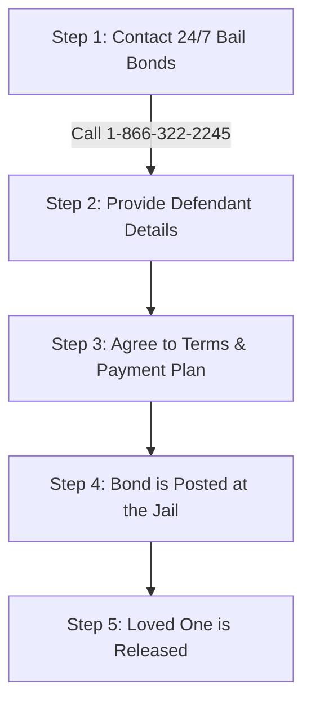

# How Bail Works Page Copy - 24/7 Bail Bonds

## Headline: Understanding the Bail Process
**Subheadline:** A clear, step-by-step guide to cash bonds, surety bonds, co-signer responsibilities, and securing a fast release.

---

## What is Bail?
Bail is a financial guarantee set by the court to ensure that an arrested individual (the defendant) returns for all scheduled court appearances after being released from custody. When bail is posted, the defendant is released while their legal case proceeds. If the defendant fails to appear in court, the bail amount is forfeited.

---

## Cash Bonds vs. Surety Bonds
It is important to understand the two most common types of bail bonds:

| Feature | Cash Bond | Surety Bond (Bail Bond) |
| :--- | :--- | :--- |
| **Payment Amount** | You must pay 100% of the full bail amount directly to the court. | You pay a small percentage (typically 10%) as a non-refundable fee to a licensed bondsman. |
| **Upfront Cost** | Very high (e.g., $10,000 bail requires $10,000 cash upfront). | Affordable (e.g., $10,000 bail requires only $1,000 to the bondsman). |
| **Availability** | Requires cash, cashier's check, or money order. | Flexible payment options and payment plans are available. |
| **Refundability** | Refunded by the court (minus fees) after the case is closed, provided the defendant attends all court dates. | The 10% fee paid to the bondsman is non-refundable, as it pays for the bondsman's service and taking on the financial risk. |

---

## What Information to Prepare
To expedite the bail process, please gather as much of the following information as possible before calling us:
1.  **Full Name:** The complete legal name of the person in custody.
2.  **Date of Birth:** The defendant's date of birth (DOB).
3.  **Jail Location:** The specific jail, detention center, or county facility where they are being held.
4.  **Bail/Bond Amount:** The total bail amount set by the judge (if known).
5.  **Charge Details:** The specific charges they are facing (if known).

*If you do not have all of this information, do not worry. Call us at 1-866-322-2245, and our agents will contact the jail directly to gather these details for you.*

---

## Responsibilities of a Co-Signer (Indemnitor)
A co-signer (or indemnitor) is a friend, family member, or loved one who signs the bail bond agreement to guarantee the defendant's release. As a co-signer, you assume the following responsibilities:
*   **Court Appearances:** You must ensure the defendant attends all scheduled court hearings until the case is fully resolved.
*   **Financial Liability:** If the defendant fails to appear in court and cannot be located, you are financially responsible for the full face value of the bail bond.
*   **Contact Information:** You must help keep the bail agency updated on the defendant’s current address, employment status, and phone number.

---

## The Release Process: Step-by-Step
Once you decide to work with 24/7 Bail Bonds, the release process is straightforward:

1.  **Consultation:** You contact us and speak directly with a licensed agent.
2.  **Verification:** We verify the bail details and defendant information with the jail.
3.  **Paperwork & Payment:** We complete the bail application and set up an affordable payment plan.
4.  **Posting the Bond:** Our local agent goes directly to the jail to post the bond.
5.  **Release:** The jail processes the paperwork and releases the defendant (this usually takes 1 to 4 hours, depending on the facility’s size and staff).

---
**Have more questions about how bail works? Speak directly with a licensed expert. Call 1-866-322-2245.**
